# 数字电路虚拟仿真实验平台

## 🧠 项目简介

本项目旨在为《计算机组成原理》课程提供一个交互式、虚拟化的数字电路实验平台。平台采用 Vue3 + SVG 技术栈开发，支持电路元件建模、电路连接、仿真验证、教学指导等功能，有效解决传统硬件教学中存在的高成本、高门槛和不可重复等问题。

学生可以通过自由拖拽元件、连接电路、运行仿真器，进行丰富的数字电路实验，并通过教学模式或挑战模式提升电路设计能力与理解能力。

## 🚀 项目特色

- 🧱 支持逻辑门、输入输出器件、存储器等多种元件建模
- 🖱 拖拽式操作，图形化画布，交互直观
- 🔁 支持子电路封装与复用，实现模块化设计
- 📚 支持 PDF 学习资料嵌入式查看
- 🔬 模拟器支持基于事件驱动的逻辑电路仿真
- 🎯 多模式支持：自由设计 / 挑战任务 / 教学实验

---

## 🛠 项目功能

### 🧪 自由模式

提供最开放的实验环境，支持如下功能：

- 拖拽放置任意元件进行电路设计
- 调整元件属性（方向、位宽、引脚数等）
- 上传 / 保存 / 删除项目
- 封装子电路以复用
- 打开学习资料辅助设计
- 使用模拟器进行运行仿真
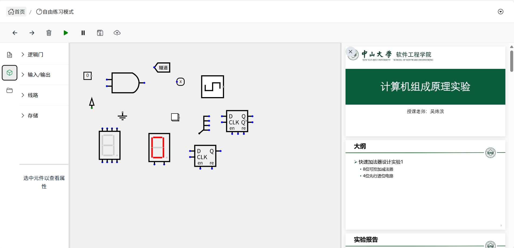

### 🎯 挑战模式

通过任务驱动强化学习效果：

- 系统内置多个实验挑战（如全加器）
- 每题给定输入引脚和输出引脚，设定输入输出的答案
- 用真值表自动验证电路正确性
- 支持项目切换、子电路封装、学习资料查看等功能
  
以“一位全加器”挑战为例：学生可以使用模拟器验证自己设计的电路，通过启停模拟器查看输入和输出是否正确，确保设计的准确性后再提交实验结果。
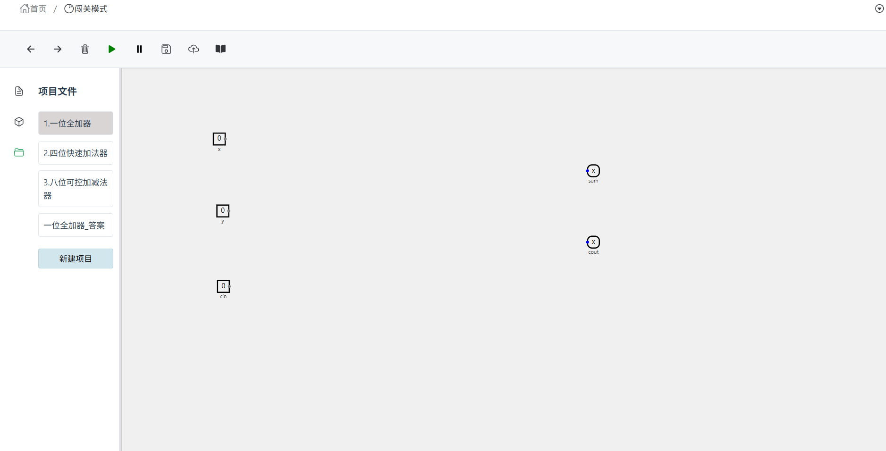
学生提交实验设计后，系统会根据真值表自动对比学生的设计输出与预期结果，判定实验是否通过并提供即时反馈。
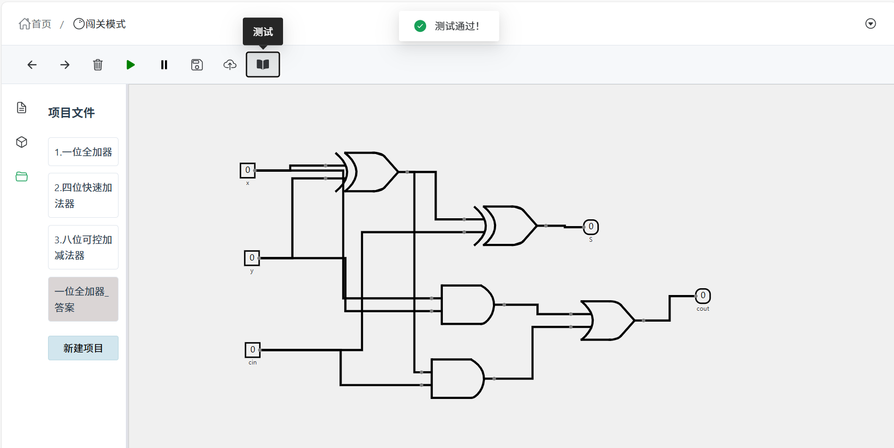

### 📘 教学模式

图文引导式教学，为学生提供平台使用指引：

- 进入教学模式后，选择想了解的教学实验
- 每步显示任务描述、操作截图、指导建议
- 完成任务后系统引导回到工作区
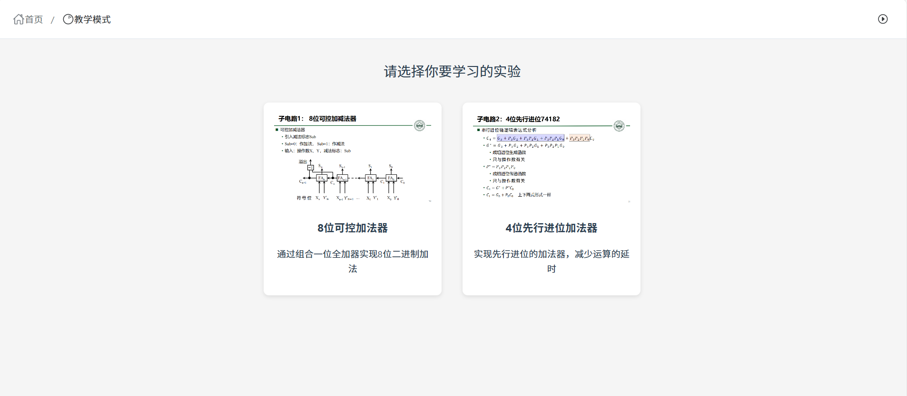
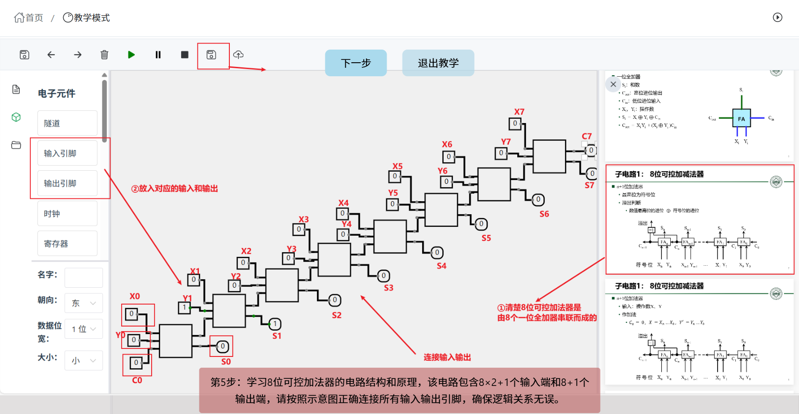
---

## 🔧 技术架构

- **前端框架**：Vue 3
- **图形渲染**：SVG + Canvas
- **电路仿真**：事件驱动模拟器（EventDrivenSimulator）
- **学习资料**：PDF 文件加载与展示（pdfjs-dist）

---

## ⚙️ 核心模块

### 元件建模

- 逻辑门
  与、或、非、异或、与非、或非、异或非
  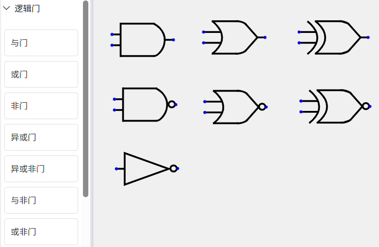
  可更改可更改引脚数量、反转引脚、改变朝向：
  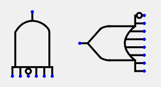

- 输入输出
  输入输出引脚、时钟、常量、电源、接地、按钮、LED、七段数码管、十六进制数码管等：
  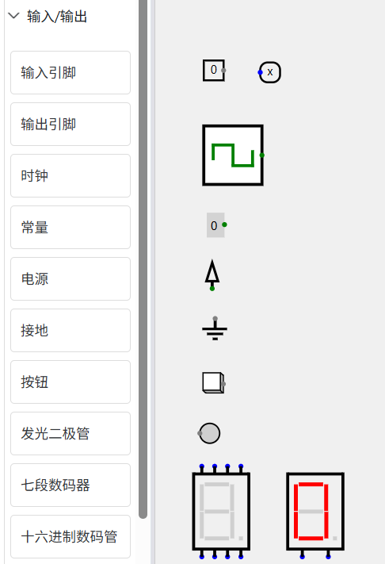

- 线路元件
  隧道、分离器、合并器
  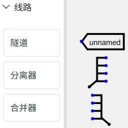

- 存储器
  寄存器、D触发器
  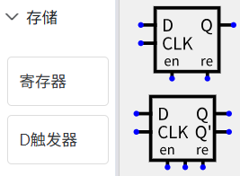

- 子电路
  支持电路封装为子组件，真值表驱动
  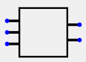

### 模拟器实现

- 基于工作队列与事件驱动机制
- 支持信号传播优化，仅处理变动部分
- 支持多项目 / 多子电路独立连接管理

### 画布建模

- 元件拖拽、连接、删除与属性面板
- 电线动态跟随与同步更新
- 支持多个项目画布自由切换

### PDF 学习资料模块

- 按钮切换资料、状态记忆滚动位置
- 使用 canvas 渲染 PDF
- 嵌入式辅助学习设计

---

## 📂 项目结构

```bash
Virtual_Project
├── README.md
├── index.html
├── package-lock.json
├── package.json
├── public
│   ├── assets          # 元件预览svg
│   └── vite.svg
├── src
│   ├── App.vue
│   ├── assets          # 元件svg以及数电实验资料pdf
│   ├── components      # 元件建模
│   ├── config
│   ├── logic           # 逻辑建模
│   ├── main.js
│   ├── modules
│   ├── router          # 路由
│   ├── store           # 电路逻辑全局管理
│   ├── style.css
│   └── views           # 页面设计
├── tsconfig.json
└── vite.config.js
```

## 🧭 快速开始

```bash
# 在项目根目录下：
# 安装依赖
npm install

# 启动项目
npm run dev

```

---

## 📌 展望与扩展

* 增加更多教学实验模块
* 支持电路分享与评分系统
* 优化移动端适配与触控操作

---

## 📜 License

MIT License.
本项目仅用于教学用途，欢迎二次开发与优化。